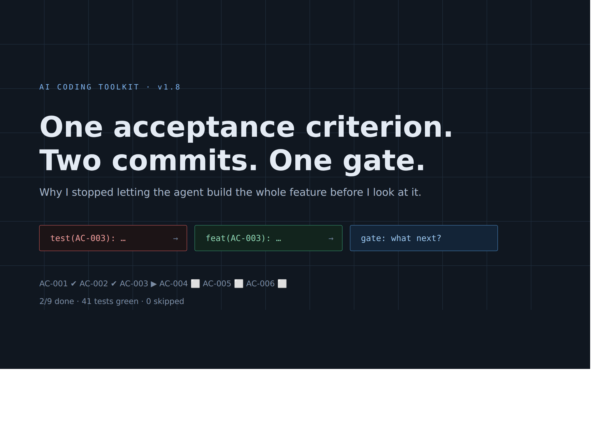
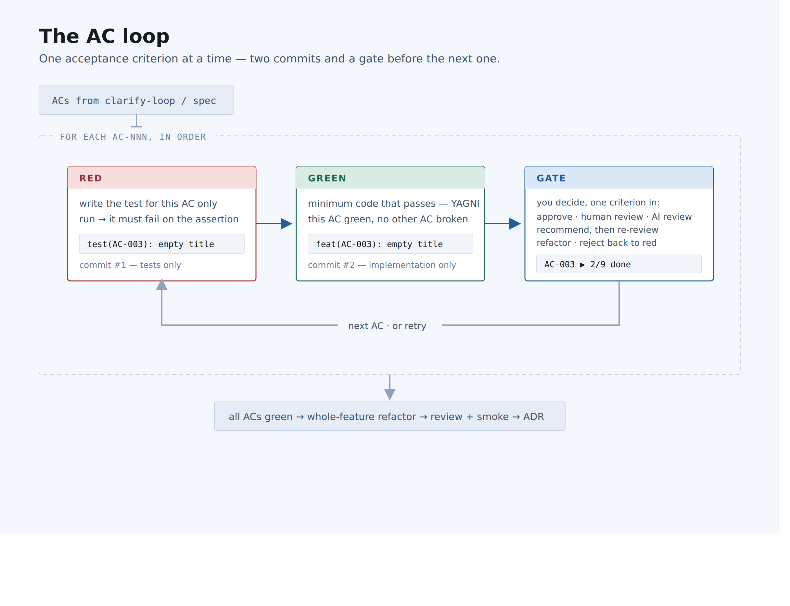
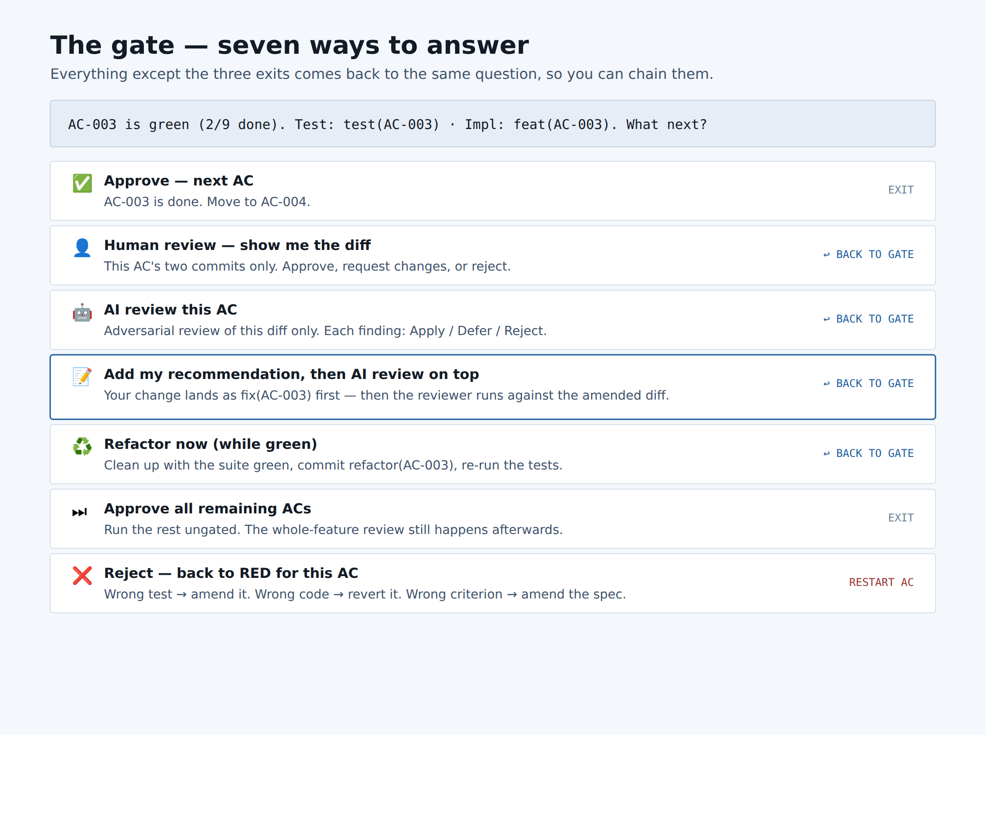
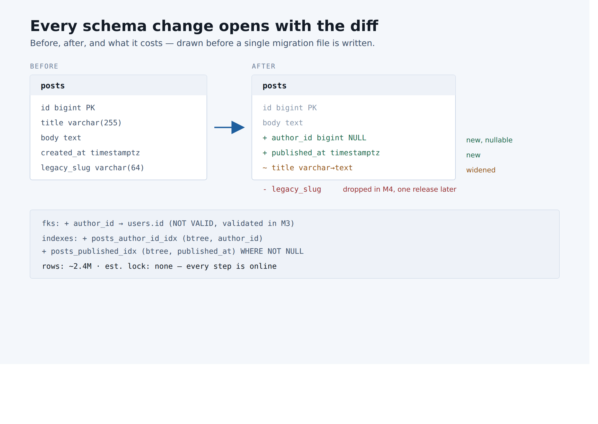
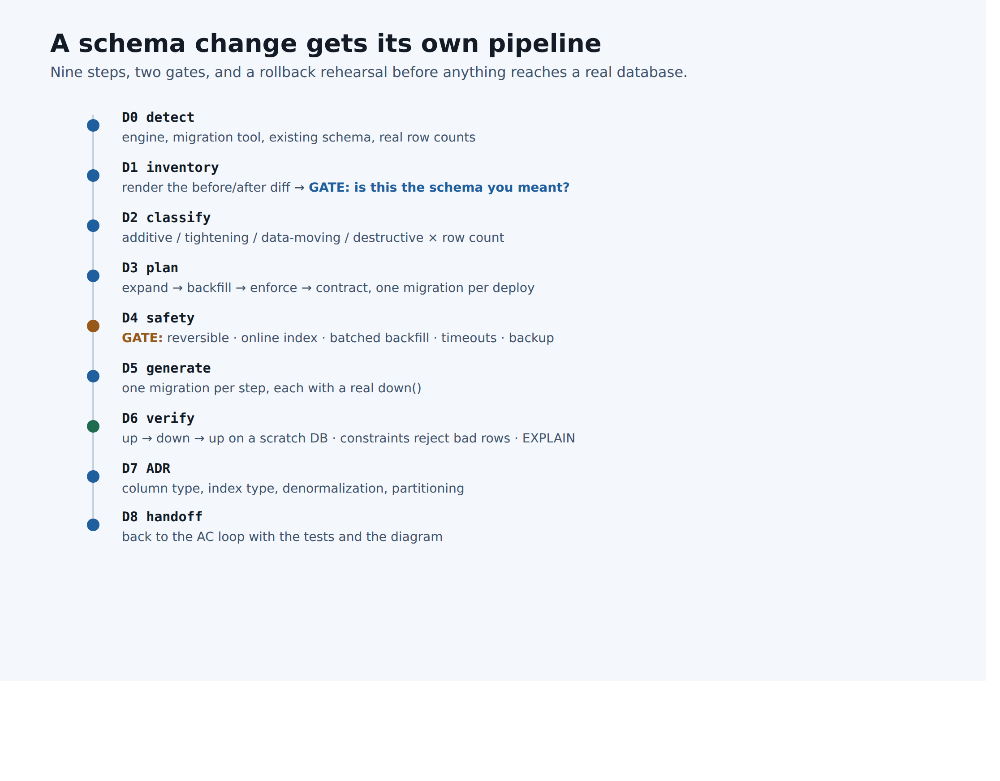

There is a specific moment where AI-assisted development goes wrong, and it is not the
moment people expect.

It is not the agent writing bad code. Modern models write decent code. It is the moment
the agent says **"done"** and hands you a diff touching fourteen files, nine behaviors and
one schema change — and asks what you think.

You cannot review that. Not really. You skim it, you spot two things, you approve it, and
the other seven behaviors go into your codebase unread. The agent did the work. You did
not do the review, whatever the approval says.

I have been building a plugin of workflow skills for exactly this problem, and the next
version changes one thing that turns out to fix most of it: **the unit of work is no
longer the feature. It is the acceptance criterion.**

---

## The old shape

The rigorous flow in the toolkit used to look reasonable on paper:

1. Write the spec with numbered acceptance criteria
2. Write **all** the failing tests
3. Implement **all** of it
4. Review, once, at the end

Step 4 is where it breaks. A nine-criterion feature reaches review as one diff. Every
finding at that point is expensive: the code around it is already written, the tests are
already green, and the momentum is all pointing at "ship it". So findings get deferred,
and deferred findings become the codebase.

The failure is structural. You do not fix it by asking people to review harder.

## The new shape



One criterion at a time:

```
AC-003  reject a post with no title

  RED    write the test for AC-003 only
         run it — it must fail on the assertion, not an import error
         commit  test(AC-003): reject a post with no title

  GREEN  write the minimum code that passes
         this AC green, no other AC broken
         commit  feat(AC-003): reject a post with no title

  GATE   stop. what next?
```

Two commits. Then it stops and asks.

That is the whole idea, and everything good about it follows from how small it is:

- **The diff you review is one behavior.** You can actually read it.
- **The history is bisectable.** `test(AC-003)` and `feat(AC-003)` sit next to each other,
  with a trailer pointing at the spec line that caused them: `Spec: docs/specs/007.md#AC-003`.
- **A wrong direction costs one criterion**, not a feature.
- **YAGNI enforces itself.** If you are writing code that no current test drives, it
  belongs to a later criterion. Stop.

## The gate is the interesting part

The naive version of this is "ask for approval after each step", which is just
interruption. The useful version is a gate you can *converse with*.



Three of those options end the turn — approve, approve everything remaining, reject back to
red. **The other four come back to the same question.** That is deliberate. It means you
can walk a chain:

> AI review this one → *three findings, one is real* → apply it → hmm, I'd also rename
> that method → **add my recommendation, then AI review on top** → clean → refactor while
> green → approve.

That fourth option is the one I use most and the one that took longest to get right. The
order matters: your recommendation is applied **first**, as its own `fix(AC-003)` commit,
and *then* the reviewer runs against the amended diff. Otherwise the reviewer keeps
critiquing code you already decided to change, and you spend the review arguing with a
ghost.

One more rule that earns its keep: a finding that belongs to a *different* criterion is
recorded and replayed at that criterion's gate. Never fixed early. Fixing it early means
writing code no current test drives, which is exactly the habit the loop exists to break.

## "But red commits will break my CI"

They would, so the loop asks once, up front:

| Style | What lands | Pick it when |
|-------|-----------|--------------|
| **two** (default) | `test(AC-NNN)` then `feat(AC-NNN)` | you want the red→green history |
| **squash** | one `feat(AC-NNN)` per criterion | CI runs on every commit and must stay green |
| **end** | one commit after all criteria | you squash-merge anyway |
| **none** | nothing — working tree only | you commit by hand |

And a hard rule regardless: a red commit is never pushed without its green pair. The loop
does not publish a knowingly failing tree.

## Test-after teams get the same loop

Plenty of teams do not write tests first, and telling them "do TDD or nothing" just means
they get nothing. So the loop has a **test-after** variant: implement the criterion, commit
`feat`, write the test, commit `test`, same gate.

It carries one extra rule, because writing tests after the code invites tests that merely
describe what the code happens to do:

> **Mutate and check.** Once the test passes, break the code path it covers — flip a
> condition, return early — confirm the test fails, then restore. A test that still passes
> against broken code is asserting nothing.

There is a third variant for plan-driven work, where the unit is a plan task (`T-04`)
rather than a criterion. Same phases, same gate. One definition, three orderings, so every
workflow in the toolkit runs the same loop instead of inventing its own checkpoints.

## Parallel builds do not get to skip the gates

When the work is fanned out to parallel agents, the loop batches rather than disappearing:

```
red tests for AC-003..AC-005  →  agents build in parallel  →  merge + full suite
                                                                    │
                            gate AC-003 → gate AC-004 → gate AC-005 ┘  (in order)
```

Concurrency changes *when* code is written. It does not change the number of gates or
their order.

---

## The other half: schema changes get their own pipeline

The second thing in this release comes from the same instinct. Ask an agent for "a posts
feature" and somewhere in that fourteen-file diff there is a migration. Migrations are the
one class of change that is genuinely hard to reverse in production, and they were getting
reviewed with the same glance as a serializer.

So schema changes leave the code loop entirely and run their own pipeline — and it starts
by drawing what is about to happen:



Not prose. Not a migration file to read. A diff of the tables, with the row count from the
actual database, the indexes it adds, the foreign keys, and the estimated lock. If the
picture is wrong, you say so before anything is generated.



Two things in there matter more than the rest.

**The risk class comes from the row count, not from the SQL.** `ADD COLUMN ... NOT NULL
DEFAULT 'x'` is trivial on a 400-row table and an outage on a 40-million-row one. The
pipeline goes and looks before it classifies.

**Nothing is reversible until you have reversed it.** Every migration ships with a real
`down()`, and D6 actually runs `up → down → up` on a scratch database. A `down()` that
throws is allowed exactly once — for the final contract step that drops the old column —
and the plan has to say so out loud.

The plan itself is the expand/contract playbook, one migration per deploy:

```
 M1 expand        M2 backfill       M3 enforce        M4 contract
 ──────────       ───────────       ──────────        ───────────
 add col NULL  →  fill in batches → NOT NULL + FK  →  drop old col
 deploy A         job (idempotent)  deploy B          deploy C
 reversible       reversible        reversible        IRREVERSIBLE
 lock: none       lock: none        lock: brief       lock: brief
```

That word `IRREVERSIBLE`, in capitals, in the column where it applies, is doing more work
than any paragraph I could write next to it.

## Ask about data before writing the criteria

The last piece closes the loop backwards. The clarify step — the questions asked before any
criterion is written — now fires a probe as soon as the task mentions a table, a column, a
migration, an index, or a model. It asks which of five things is actually happening:

| | | Risk |
|---|---|---|
| **A** | No schema change | — |
| **B** | New tables only, additive | low |
| **C** | Alter tables that already hold rows | medium–high |
| **D** | Data migration — existing rows rewritten | high |
| **E** | A new datastore entirely | architecture decision |

Because the answer changes what the acceptance criteria have to *say*. C and D get their
own data criteria: the constraint rejects a bad row, the backfill is idempotent, the
rollback restores the previous shape. Those are testable behaviors, and if nobody asks the
question they never become criteria at all.

---

## The pattern underneath

Every one of these changes is the same move: **make the unit of review small enough that a
human can actually do it, then make the tool stop there.**

Not "review more carefully". Not "add a checklist". Cut the work into pieces the size of a
decision, and put a real decision point at the end of each one — one you can answer with
*"AI review it, then let me add something, then review that"* rather than a binary approve.

The agent is very good at doing the work. It is bad at knowing when you needed to look.
That is the part worth designing.

---

*The plan, the loop reference, and the diagram templates are open source under MIT in the
[ai-coding-toolkit plugin](https://github.com/MiladNalbandi/ai-coding-toolkit-plugin) — it
works with Claude Code and, through a parallel port, with opencode.*
