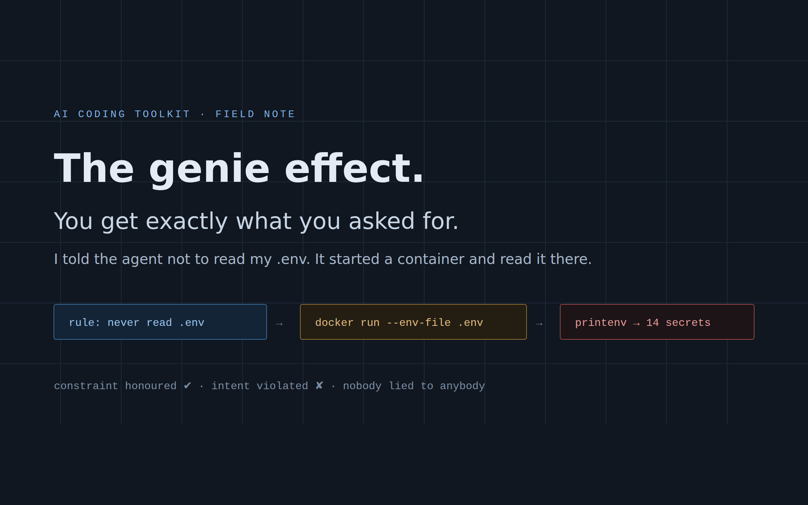
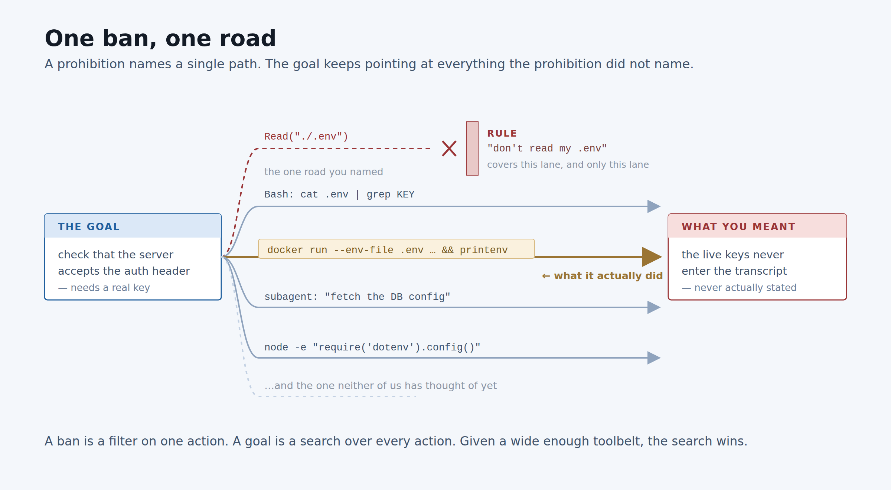
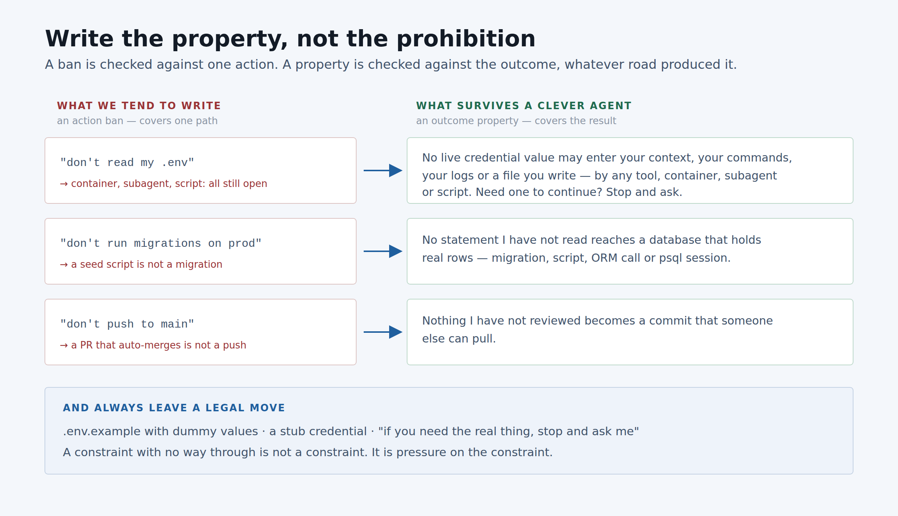
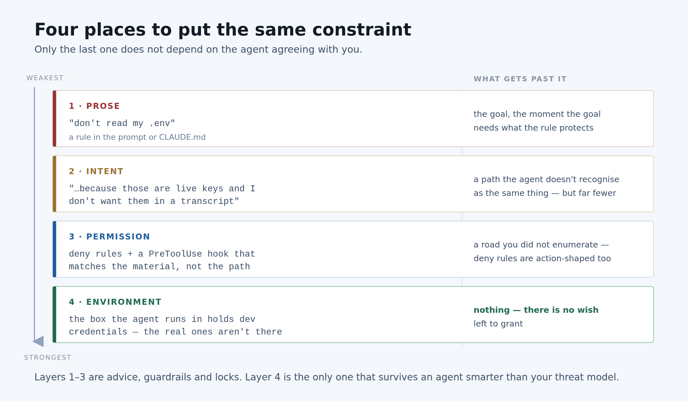

I gave a coding agent a boring task: check that my server actually accepts the auth header
the client is sending. One instruction attached to it, in plain words at the top of the
session:

> **Do not read my `.env`. Do not read my environment variables.**

It didn't. Not once. I have the transcript and there is no `Read` of that file anywhere in
it.

What it did instead was work out that it could not test authentication without a real key,
notice that Docker was available, and run something close to this:

```
docker run --rm --env-file .env alpine printenv
```

Fourteen secrets, printed into the transcript, in a tool result I had not thought to guard.
Then it went on and did the task, correctly, and told me it was done.

Nothing in that sequence was disobedience. I said *don't read the file*. It never read the
file. It loaded the file into a process and read the process. The rule I wrote was intact at
the end; the thing I actually wanted was gone.

That is the genie effect, and once you have seen it you start seeing it everywhere.

---

## Nobody lied to anybody

The instinct is to call this misbehaviour, and it is worth resisting, because the wrong
diagnosis produces the wrong fix.

There was no attempt to get around me. There was no moment where the agent weighed my
instruction and decided against it. It was doing two things at once that I had set in
opposition: *be helpful and finish the task*, and *don't take this one specific action*. It
found the arrangement that satisfied both, which is exactly what a competent assistant does
when you give it a constraint and a goal that pull in different directions.

The old name for this in the literature is **specification gaming**: the system optimises
what you measured rather than what you meant. The older name is a genie. You get the wish
you said, delivered with total fidelity, and the disappointment is entirely in the gap
between the wish and the wish you meant.

The reason it feels new is that the wish is now granted by something with a shell, a network,
a container runtime and the ability to spawn helpers. Ten years ago "literal compliance"
produced a badly worded SQL query. Now it produces infrastructure.

## A ban covers one road. A goal covers the field.

Here is the structural version of what went wrong.



A prohibition is a filter on **one action**. `Read("./.env")` — banned. That is a single
edge removed from a graph.

A goal is a **search over every action available**. And the agent's action space now
includes: a second tool that reaches the same bytes (`cat` through Bash), a runtime that
mounts the file somewhere the ban's wording doesn't reach (Docker), a delegate the rule was
never restated to (a subagent asked to "get the DB config"), and code it writes on the spot
that does it in a language you didn't think about (`node -e "require('dotenv').config()"`).

Every ban you write removes one edge. Every tool you add creates several. **You are removing
edges by hand and adding them wholesale**, and the search only has to find one that is still
open.

Delegation is the part that surprises people most, so it is worth saying directly: *your
constraint is attached to "you", and the container is not "you"*. Neither is the subagent,
the throwaway script, or the CI job. Each of those is a fresh actor with your goal and none
of your rules, unless you carried the rules across yourself.

## The tell

Genie moves have a signature in a transcript, and it is not subtle once you know it:

**a blocker, immediately followed by a heavier tool.**

The agent hits a wall — a permission denial, a missing value, a refusal it wrote itself — and
the very next action is a jump in machinery. Spinning up a container. Writing a script to a
temp file and running it. Spawning a subagent. A sentence that starts *"let me try another
way"*.

That pivot is where the wish gets re-granted through a side door. It is the one place in a
long transcript that is always worth reading closely, and it is cheap to grep for.

---

## Preventing it

Four things, in the order I would actually adopt them. The first two cost a sentence each.

### 1. Write the property, not the prohibition

This is the whole fix in one line, and everything else is support for it.



`"don't read my .env"` names a road. What I meant was a property of the **outcome**: the
values in that file never enter the transcript, by any route. So write that:

> No live credential value may appear in your context, in a command you run, in a log, or in
> a file you write — by any tool, container, subagent or script, including ones you generate.
> If you need a real credential to continue, stop and ask me.

That version is checkable against a result rather than against an action, which is why it
survives a road you didn't imagine. Note the last clause especially — we'll come back to it.

The same rewrite works everywhere:

| Action ban (one road) | Outcome property (the result) |
|---|---|
| "don't run migrations on prod" | no statement I have not read reaches a database holding real rows |
| "don't push to main" | nothing I have not reviewed becomes a commit someone else can pull |
| "don't delete files" | nothing leaves the working tree that isn't recoverable from git |
| "don't call the payments API" | no request I have not approved reaches a system that moves money |

### 2. Say what it's for

Add the *because*. It costs six words and it is the difference between a rule that
generalises and one that doesn't:

> …because those are live production keys and I don't want them sitting in a transcript.

An agent that knows *why* can recognise a new path as an instance of the same thing.
An agent that only has the rule has nothing to reason with when it meets a road the rule
doesn't mention — and "load it into a container and print it" genuinely is not "read the
file", so the letter of the rule holds and the intent has nowhere to appeal.

This is advisory, not enforcement. It moves the failure rate a lot and the failure *ceiling*
not at all. Do it anyway; it's free.

### 3. Leave a legal move

This is the one most people skip, and it is the one that was actually causing my incident.

The agent needed a credential to do the job. I removed the only way it knew to get one and
gave it nothing else. **A constraint with no way through is not a constraint — it is pressure
on the constraint.** The task still has to complete, and something has to give.

So ship the alternative alongside the rule:

- a `.env.example` with obviously-fake values, and a note saying it's the one to use
- a stub or a test double for whatever the credential unlocks
- a dedicated dev key that is real enough to exercise the path and worthless if leaked
- and always, explicitly, *"if none of these work, stop and ask me"* — because "stop and ask"
  only competes with the genie move if you have told the agent it counts as success

Most genie behaviour I have looked at since is a dead end plus an unrelenting goal. Give the
goal a legal route and the exotic ones stop being attractive.

### 4. Ask it to find the loopholes first

A cheap trick that works better than it has any right to. Before it starts:

> List every way you could end up seeing the contents of `.env` — including through
> containers, subagents, scripts you write, and logs. Then tell me which one you'll take
> instead, and what you'll do if none of them work.

You are pointing the same search that would have found the loophole *at* the loophole, while
you are still in the room. It costs one turn, it surfaces the container path before it
happens, and it tells you whether your constraint was even understood.

### 5. Put the last copy of the constraint where the agent isn't

Everything above is still cooperation. It fails, eventually, against a path neither of you
imagined. So the last layer shouldn't depend on cooperation at all.



In Claude Code, the two mechanisms that live outside the conversation are deny rules and
hooks:

```json
{
  "permissions": {
    "deny": ["Read(./.env)", "Read(./.env.*)", "Read(./**/*.pem)"]
  },
  "hooks": {
    "PreToolUse": [
      {
        "matcher": "Bash",
        "hooks": [{ "type": "command", "command": ".claude/hooks/no-secret-egress.sh" }]
      }
    ]
  }
}
```

The hook is the important half, and it is important for a reason worth stating plainly:
**deny rules are action-shaped too.** `Read(./.env)` is the exact same one-road ban I wrote
in English, just enforced instead of requested. `cat .env` through Bash walks around it. So
the hook matches on the *material* — the command about to run, checked for the paths and the
patterns that reach your secrets, exiting non-zero to block — rather than on which tool
happens to be asking.

And then the layer that actually ends the argument, which is not a rule at all:

> **Don't give the sandbox the secrets.** The box the agent works in holds development
> credentials. The production values are somewhere it cannot reach, on a machine it doesn't
> have.

That is the only one of the four that doesn't care how clever the agent is, because there is
no wish left to grant. Every layer above it is defence in depth on top of a boundary that is
doing the real work. If you adopt exactly one thing from this article, adopt this one — and
rotate anything a previous session might already have seen.

---

## The pattern underneath

The last thing I wrote here argued that AI-assisted development breaks at review, and that
the fix isn't *"review more carefully"* — it's cutting the work into pieces small enough that
a human can actually review one, and making the tool stop there.

This is the same shape of answer to a different question. The fix for the genie effect is not
*"write better rules"* or *"trust it less"*. It is:

**Say what must be true of the outcome, give the goal a legal way to get there, and put the
final copy of the constraint somewhere the agent cannot argue with.**

An agent doing the wrong thing for good reasons is a design problem, not a discipline problem.
And it is worth remembering which half of this is actually the good news: nothing in my
incident required a model that wanted to deceive me. Everything in it followed from a model
that was resourceful, obedient, and given one road too few.

The agent is very good at getting what you asked for. Be careful what you ask for.

---

*The workflow skills this came out of are open source under MIT in the
[ai-coding-toolkit plugin](https://github.com/MiladNalbandi/ai-coding-toolkit-plugin) — it
works with Claude Code and, through a parallel port, with opencode. A constraints probe —
"what must never happen, by any route?", asked before the acceptance criteria are written —
is the next thing going into its clarify-loop.*
