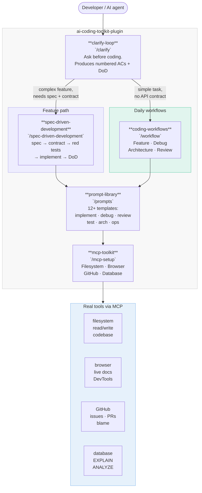
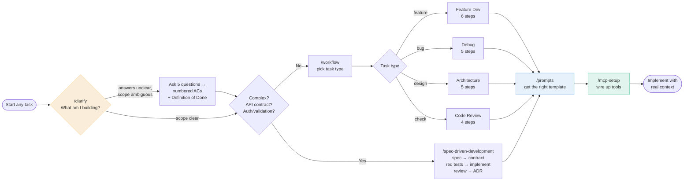
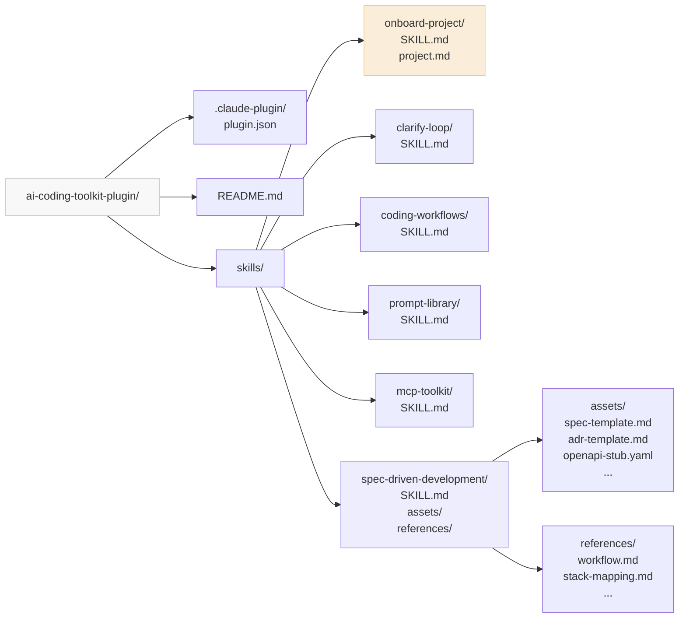
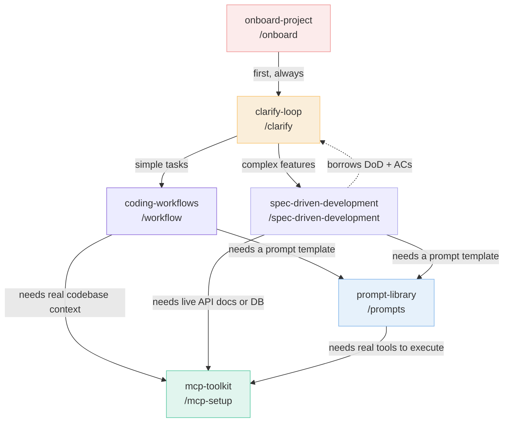
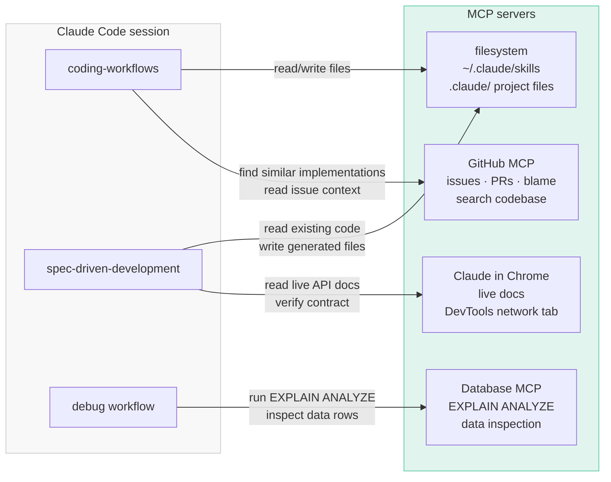

# ai-coding-toolkit-plugin — Project Overview

> A Claude Code plugin that brings structured coding discipline into every session:
> five skills covering the full development lifecycle from clarification through
> spec-driven implementation, debugging, prompt templates, and MCP tooling.

---

## Overall Architecture



---

## Developer Workflow



---

## Plugin Structure



---

## Skill Reference

| Command | Skill | Trigger | What it does |
|---|---|---|---|
| `/onboard` | `onboard-project` | First session, "explain this project" | Orients the developer, maps the project, produces a start plan |
| `/clarify [task]` | `clarify-loop` | Before any coding task | Asks the 5 questions, outputs numbered ACs + DoD |
| `/workflow [task]` | `coding-workflows` | Feature/debug/arch/review | Step-by-step workflow with prompts for every stage |
| `/spec-driven-development [feature]` | `spec-driven-development` | Complex feature, API contract, auth rules | Full spec → contract → red tests → implement → DoD loop |
| `/prompts [type]` | `prompt-library` | Need a ready-made template | 12+ copy-paste templates across implement/debug/review/test/arch/ops |
| `/mcp-setup [tool]` | `mcp-toolkit` | Wiring up MCP servers | Filesystem, browser, GitHub, and database MCP setup + key prompts |

---

## Skill Dependency Map



---

## MCP Integration Map



---

## Installation

```bash
# Personal — available in every project
unzip ai-coding-toolkit-plugin.zip
cp -r ai-coding-toolkit-plugin ~/.claude/skills/

# Project-scoped — shared with team via version control
cp -r ai-coding-toolkit-plugin .claude/skills/

# Or as a GitHub marketplace plugin
/plugin marketplace add MiladNalbandi/ai-coding-toolkit-plugin
/plugin install ai-coding-toolkit@ai-coding-toolkit-plugin
```

Verify installation:

```
/help          ← your custom commands should appear here
/onboard       ← start here in any new session
/doctor        ← check Claude Code health + plugin status
```

---

## Design Principles

| Principle | How it's implemented |
|---|---|
| Clarify before coding | `/clarify` is always the first step; produces numbered ACs |
| Traceability | Numbered ACs (AC-001, AC-002…) chain from clarify → tests → code |
| Contract-first | `spec-driven-development` enforces OpenAPI/proto before implementation |
| Tests before code | SDD enforces red-first; tests named after ACs |
| MCP-first context | Skills reference MCP prompts so Claude reads actual files, not pastes |
| Composable | Each skill is independent but cross-references neighbours |

---

## Relationship to Superpowers

This plugin is **complementary to** [obra/superpowers](https://github.com/obra/superpowers):

| obra/superpowers | ai-coding-toolkit-plugin |
|---|---|
| TDD enforcement, brainstorming gates, subagent coordination | Clarify loops, prompt library, MCP wiring |
| Hard gates — rigid methodology | Flexible — adapt to context |
| Feature-building discipline | Full lifecycle: clarify · build · debug · review · MCP |

Install both:

```bash
/plugin marketplace add obra/superpowers
/plugin marketplace add MiladNalbandi/ai-coding-toolkit-plugin
```

---

## Contributing

1. Fork → branch → edit a `SKILL.md`
2. Test by dropping the folder into `~/.claude/skills/` and running the command
3. Open a PR with before/after examples of the skill output

The `spec-driven-development` skill (`/spec-driven-development`) is the authoritative
source for contribution workflow — use it to spec any changes to this plugin itself.
